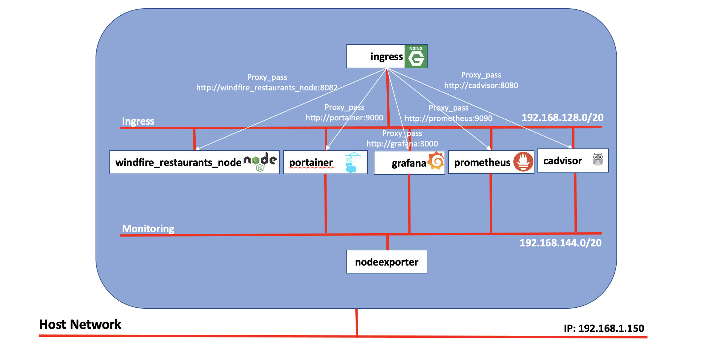

# Windfire Monitoring
- [Introduction](#introduction)
- [Before you start](#before-you-start)
- [Nginx](#nginx)
- [Windfire Restaurants](#windfire-restaurants)
- [Grafana](#grafana)
- [Prometheus](#prometheus)
- [Cadvisor](#cadvisor)
- [Node Exporter](#node-exporter)

## Introduction
This repository holds code and examples to configure and run monitoring tools for containerized applications.

All the tools are configured to run behind a Reverse Proxy, implemented with Nginx (https://www.nginx.com/), which shields and concentrates the access to several applications, as seen in the architecture diagram below.

Nginx runs as a container and is configured as a Reverse Proxy, with several *proxy_pass* directives that redirect to the following components running behind the proxy (see [Nginx](#nginx) paragraph for more details):
- [Windfire Restaurants](#windfire-restaurants) - 
- [Grafana](#grafana) - 
- [Prometheus](#prometheus) - 
- [Cadvisor](#cadvisor) - 

Node Exporter does not have a relevant UI and for this reason runs in the backend and is not exposed through Nginx (see [Node Exporter](#node-exporter) paragraph for more details).

## Before you start
Before starting to experiment with the samples provided in this repository, you just need to have Docker and Docker Compose properly installed on your environment.

Refer to the following:
 - https://docs.docker.com/engine/install/ for Docker engine installation
 - https://docs.docker.com/compose/install/ for Docker Compose installation

## Nginx
[Nginx](https://www.nginx.com/) is a free, open source HTTP web server, mail proxy server, reverse proxy and load balancer for HTTP, TCP and UDP traffic.

Nginx behavior is defined in a specific configuration file named **[default.conf](nginx/default.conf)**, that is copied to the Docker image when it is built.

## Windfire Restaurants 
[TODO]

## Grafana
[Grafana](https://grafana.com/) is an open-source platform for data visualization, monitoring and analysis that has become quite popular as a tool for Observability, allowing to query, visualize, alert on and understand environment metrics no matter where they are stored.

## Prometheus
[Prometheus](https://prometheus.io/) is an open-source system monitoring and alerting toolkit. It is configured via **[prometheus.yml](prometheus/prometheus.yml)** specific configuration file that is copied to the Docker image when it is built.

## cAdvisor
[cAdvisor](https://github.com/google/cadvisor) provides container users an understanding of the resource usage and performance characteristics of their running containers. It is a running daemon that collects, aggregates, processes, and exports information about running containers. Specifically, for each container it keeps resource isolation parameters, historical resource usage, histograms of complete historical resource usage and network statistics.

## Node Exporter
[Node Exporter](https://github.com/prometheus/node_exporter) is a Prometheus exporter for hardware and OS metrics with pluggable metric collectors.

## Portainer
[Portainer](https://www.portainer.io/) is an open source tool for managing container based applications in Kubernetes, Docker, Docker Swarm, Azure ACI and edge environments. It can be used to simplify and streamline all the tasks needed to manage containers effectively, such as starting, stopping, opening a terminal into the running container, accessing the logs and much more.